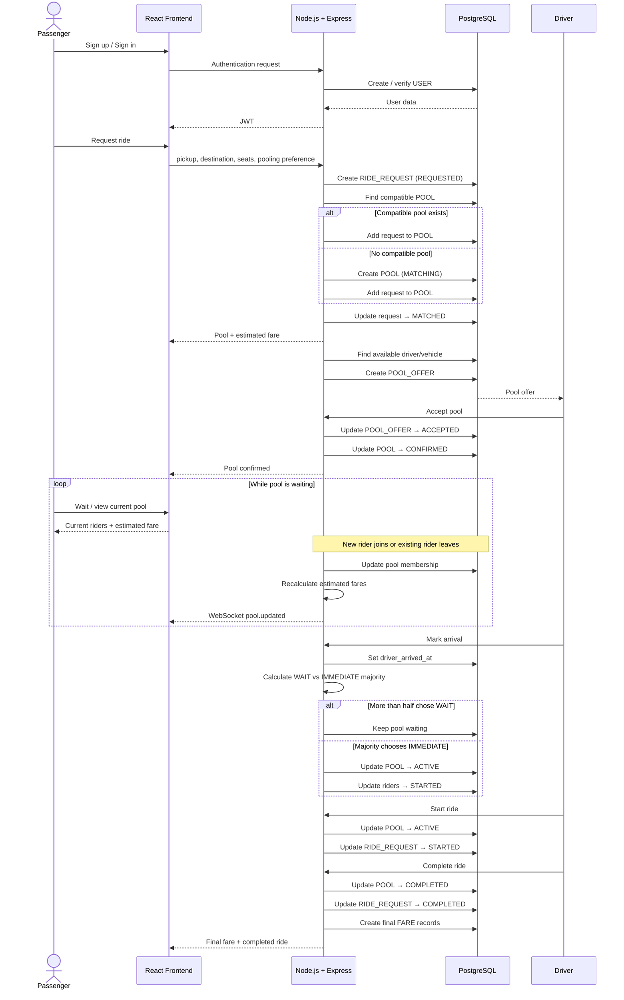
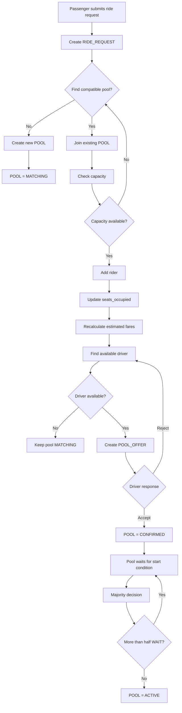
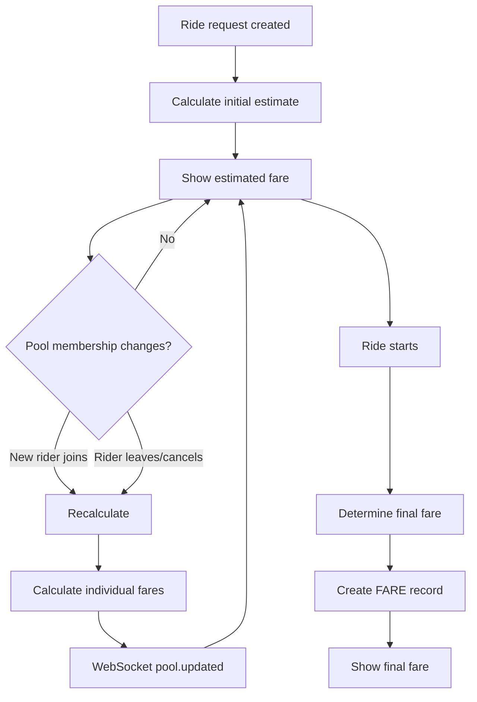
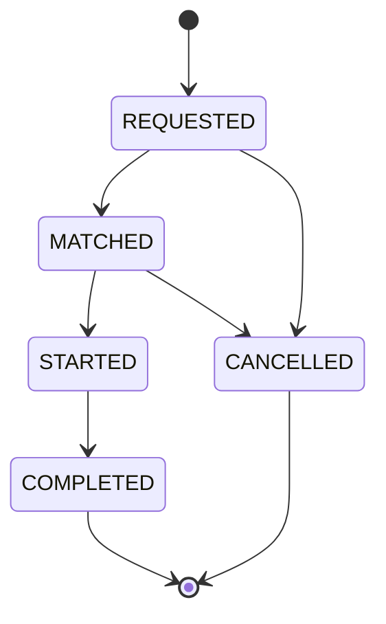
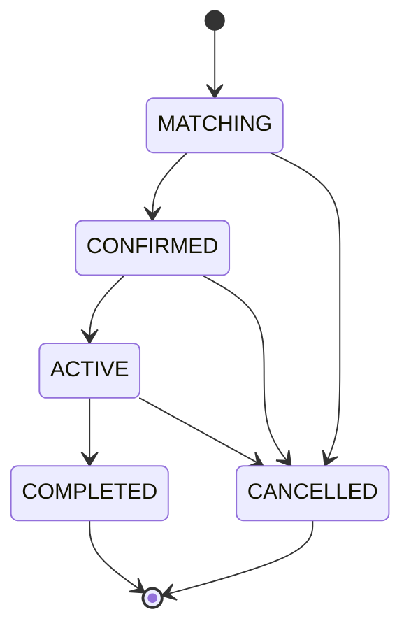
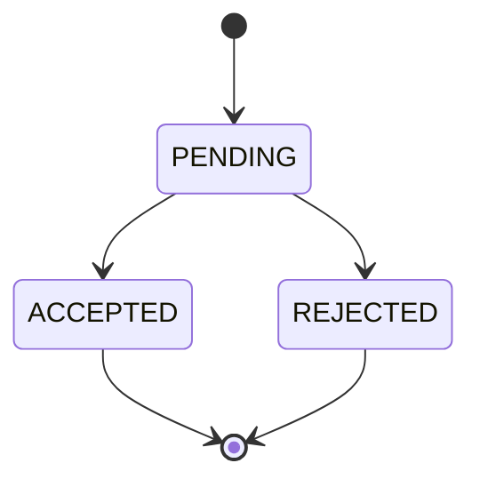

# 1. Complete Ride Lifecycle

```mermaid
sequenceDiagram
    actor Passenger
    participant FE as React Frontend
    participant API as Node.js + Express
    participant DB as PostgreSQL
    participant Driver

    Passenger->>FE: Sign up / Sign in
    FE->>API: Authentication request
    API->>DB: Create / verify USER
    DB-->>API: User data
    API-->>FE: JWT

    Passenger->>FE: Request ride
    FE->>API: pickup, destination, seats, pooling preference
    API->>DB: Create RIDE_REQUEST (REQUESTED)
    API->>DB: Find compatible POOL

    alt Compatible pool exists
        API->>DB: Add request to POOL
    else No compatible pool
        API->>DB: Create POOL (MATCHING)
        API->>DB: Add request to POOL
    end

    API->>DB: Update request → MATCHED
    API-->>FE: Pool + estimated fare

    API->>DB: Find available driver/vehicle
    API->>DB: Create POOL_OFFER
    DB-->>Driver: Pool offer

    Driver->>API: Accept pool
    API->>DB: Update POOL_OFFER → ACCEPTED
    API->>DB: Update POOL → CONFIRMED
    API-->>FE: Pool confirmed

    loop While pool is waiting
        Passenger->>FE: Wait / view current pool
        FE-->>Passenger: Current riders + estimated fare

        Note over API,DB: New rider joins or existing rider leaves
        API->>DB: Update pool membership
        API->>API: Recalculate estimated fares
        API-->>FE: WebSocket pool.updated
    end

    Driver->>API: Mark arrival
    API->>DB: Set driver_arrived_at

    API->>API: Calculate WAIT vs IMMEDIATE majority

    alt More than half chose WAIT
        API->>DB: Keep pool waiting
    else Majority chooses IMMEDIATE
        API->>DB: Update POOL → ACTIVE
        API->>DB: Update riders → STARTED
    end

    Driver->>API: Start ride
    API->>DB: Update POOL → ACTIVE
    API->>DB: Update RIDE_REQUEST → STARTED

    Driver->>API: Complete ride
    API->>DB: Update POOL → COMPLETED
    API->>DB: Update RIDE_REQUEST → COMPLETED
    API->>DB: Create final FARE records

    API-->>FE: Final fare + completed ride
```

# 2. Pool Matching Lifecycle

```mermaid
flowchart TD
    A[Passenger submits ride request] --> B[Create RIDE_REQUEST]
    B --> C{Find compatible pool?}

    C -->|Yes| D[Join existing POOL]
    C -->|No| E[Create new POOL]

    E --> F[POOL = MATCHING]
    D --> G[Check capacity]

    G --> H{Capacity available?}
    H -->|No| C
    H -->|Yes| I[Add rider]

    I --> J[Update seats_occupied]
    J --> K[Recalculate estimated fares]
    K --> L[Find available driver]

    L --> M{Driver available?}
    M -->|No| N[Keep pool MATCHING]
    M -->|Yes| O[Create POOL_OFFER]

    O --> P{Driver response}
    P -->|Reject| L
    P -->|Accept| Q[POOL = CONFIRMED]

    Q --> R[Pool waits for start condition]
    R --> S[Majority decision]
    S --> T{More than half WAIT?}

    T -->|Yes| R
    T -->|No| U[POOL = ACTIVE]
```

# 3. Fare Lifecycle

```mermaid
flowchart TD
    A[Ride request created] --> B[Calculate initial estimate]
    B --> C[Show estimated fare]

    C --> D{Pool membership changes?}

    D -->|New rider joins| E[Recalculate]
    D -->|Rider leaves/cancels| E
    D -->|No| C

    E --> F[Calculate individual fares]
    F --> G[WebSocket pool.updated]
    G --> C

    C --> H[Ride starts]
    H --> I[Determine final fare]
    I --> J[Create FARE record]
    J --> K[Show final fare]
```

# 4. State Machines

## RIDE_REQUEST

```mermaid
stateDiagram-v2
    [*] --> REQUESTED
    REQUESTED --> MATCHED
    REQUESTED --> CANCELLED

    MATCHED --> STARTED
    MATCHED --> CANCELLED

    STARTED --> COMPLETED

    COMPLETED --> [*]
    CANCELLED --> [*]
```

## POOL

```mermaid
stateDiagram-v2
    [*] --> MATCHING

    MATCHING --> CONFIRMED
    MATCHING --> CANCELLED

    CONFIRMED --> ACTIVE
    CONFIRMED --> CANCELLED

    ACTIVE --> COMPLETED
    ACTIVE --> CANCELLED

    COMPLETED --> [*]
    CANCELLED --> [*]
```

## POOL_OFFER

```mermaid
stateDiagram-v2
    [*] --> PENDING
    PENDING --> ACCEPTED
    PENDING --> REJECTED

    ACCEPTED --> [*]
    REJECTED --> [*]
```